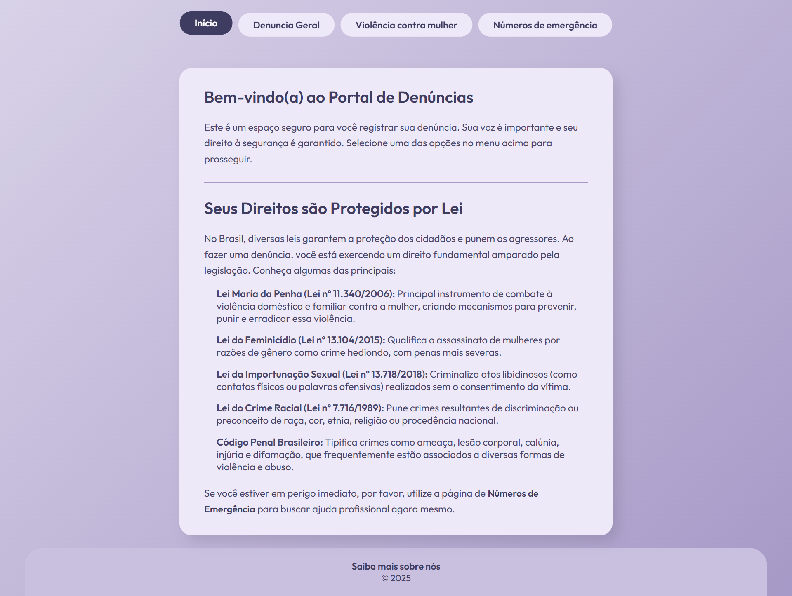
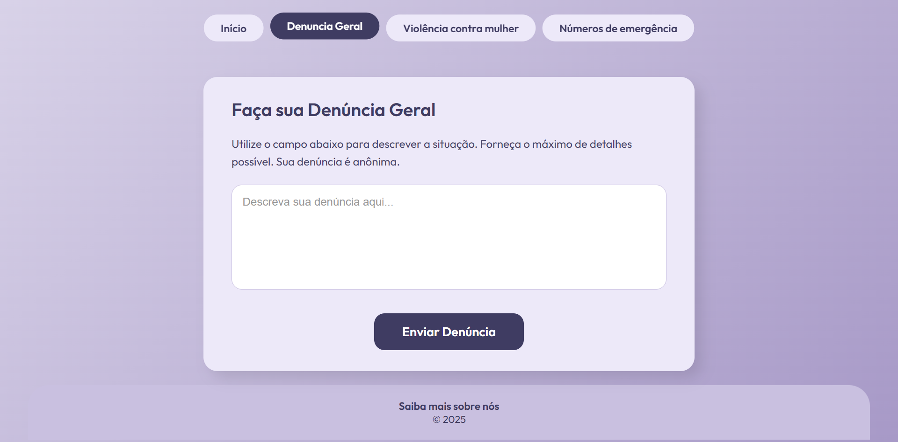
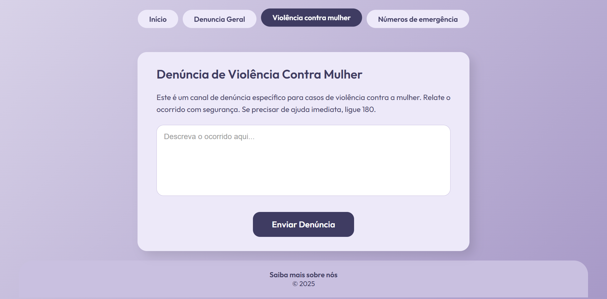
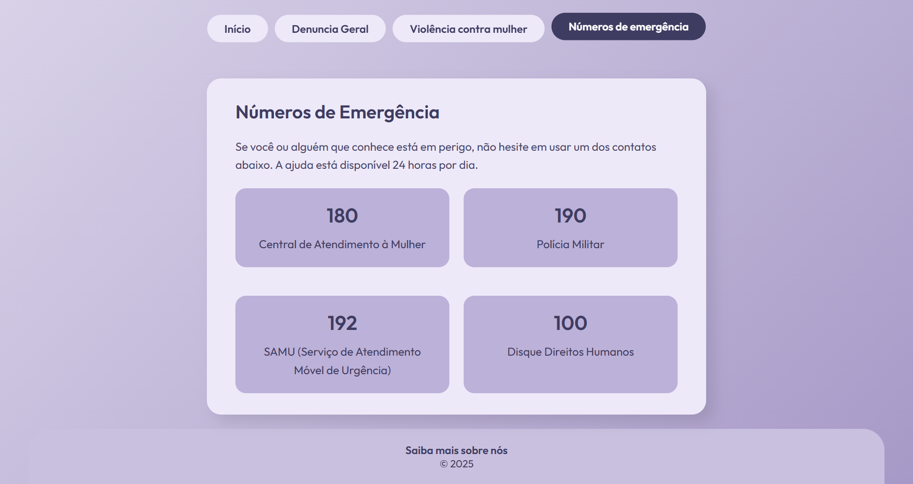

# Denuncia anônima - contra a violência
## Site de denuncia focado no anonimato da vítima


### Introdução
Safe Speak tem a proposta de trazer um lugar de conforto para vítimas de violência que não conseguem denunciar por meios convencionais de denuncia como uma ligação ou prestando queixa. Com a ajuda deste site é possível fazer a denúncia por escrita e transformar em fala, nós então armzenamos esses dados para uso posterior contra o agressor(a).

---

### Estrutura das pastas

#### Website
``` Website
├── src/                    
│   ├── assets/           
│   │   ├── images/
│   │   │   ├── icons/
│   │   │   |   ├── github.svg
|   │   │   |   │
│   │   │   |   └── linkedin.svg
│   │   │   |
│   │   │   ├── people/
│   │   │   │   ├── GabrielVereda.png
|   │   │   │   │
│   │   │   │   ├── RodrigoJunior.jpeg
|   │   │   │   │
│   │   │   │   ├── RyanFerreira.png
|   │   │   │   │
│   │   │   │   └── ViniciusAraujo.jpeg
│   │   │   │
│   │   │   └── heroimage.svg
│   │   │   
│   │   └── screenshots/
│   │       ├── denuncia_mulher.png
|   │       │
│   │       ├── denuncia.png
│   │       │   
|   │       ├── inicio.png
│   │       │
│   │       └── numeros.png
│   │   
│   ├── js/  
│   │   ├── denuncia.js
│   │   │
│   │   └── mulher.js   
│   │
│   ├── pages/
│   |   ├── denuncia-geral.html
|   |   │
│   |   ├── numeros-emergencia.html
|   |   │
│   |   ├── sobre.html
|   |   │
│   |   └── violencia-mulher.html
│   |
│   └── styles/     
│       ├── forms.css
│       │
│       ├── global.css
│       │   
│       ├── numeros.css
│       │
│       └── index.css
│
├── index.html
│   
├── LICENSE
│
└── README.md
```

#### Spring Boot

#### Banco de dados
---

### Linguagens utilizadas
1. Front-end
    - HTML
    - CSS
    - Javascript (Consumos de api)

2. Back-end
    - Spring boot (Maven e Java)
    - MySQL
    - Azure AI Speech

---

## 🌐 Demonstração

🔗 **Acesse o site:** [site-denuncia-safe-speak.vercel.app](https://site-denuncia-safe-speak.vercel.app)

---

## 📸 Capturas de Tela

### 🏠 Página Inicial
Apresenta informações sobre o portal e as principais leis de proteção no Brasil.  
Inclui referências à **Lei Maria da Penha**, **Lei do Feminicídio**, **Lei de Importunação Sexual**, entre outras.



---

### 🚨 Denúncias gerais
Página dedicada ao registro de **denúncias contra qualquer pessoa/empresa**, com um campo de relato seguro e botão de envio.



---

### 🚨 Violência Contra Mulher
Página dedicada ao registro de **denúncias específicas de violência contra a mulher**, com um campo de relato seguro e botão de envio.



---

### 📞 Números de Emergência
Reúne os principais números de emergência nacionais, com destaque para:
- **180** — Central de Atendimento à Mulher  
- **190** — Polícia Militar  
- **192** — SAMU  
- **100** — Disque Direitos Humanos  



---

### Créditos

@BielVereda

@GoBrazill 

@RodrigoJPSilva

@srjuninn